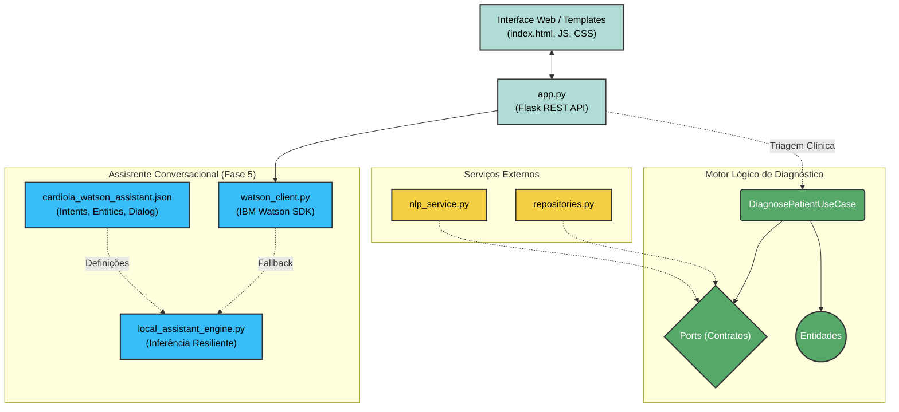

# CardioIA - API & Módulo Conversacional (Fase 5)

## 🏗 Estrutura e Arquitetura

A pasta `api/` abriga o ecossistema de inteligência do CardioIA, organizado em arquitetura limpa e modular:

1. **`chatbot/`**: Módulo conversacional baseado no **IBM Watson Assistant** (`cardioia_watson_assistant.json`), cliente de integração (`watson_client.py`) e motor local resiliente de inferência (`local_assistant_engine.py`).
2. **`core/`**: Entidades clínicas (`entities.py`), contratos/portas (`ports.py`) e casos de uso de diagnóstico (`use_cases.py`).
3. **`infrastructure/`**: Adaptador de NLP com spaCy + scikit-learn (`nlp_service.py`) e repositórios de dados (`repositories.py`).
4. **`templates/` & `static/`**: Interface Web moderna do Chatbot (HTML5, CSS3, JavaScript com design cardiológico e badge dinâmico de risco).
5. **`app.py`**: Servidor Web Flask expondo as rotas da interface e a API REST.
6. **`main.py`**: Pipeline batch de triagem por TF-IDF.



---

## 🌐 Endpoints da API Flask (`app.py`)

| Método | Rota | Descrição |
| :--- | :--- | :--- |
| `GET` | `/` | Renderiza a interface web interativa do chatbot. |
| `POST` | `/api/chat` | Envia mensagem do usuário e recebe resposta contextualizada, intents, entidades e nível de risco. |
| `POST` | `/api/session` | Cria uma nova sessão conversacional única. |
| `GET` | `/api/health` | Verifica status de saúde do backend e da conexão com o IBM Watson. |
| `POST` | `/api/triage` | Triagem combinada (Chatbot + Ontologia de doenças por TF-IDF). |

---

## 🚀 Como Executar Localmente

```bash
# 1. Ative o ambiente virtual
# No Linux / Mac:
source ../.venv/bin/activate
# No Windows:
..\.venv\Scripts\activate

# 2. Instale as dependências
pip install -r requirements.txt
python -m spacy download pt_core_news_sm

# 3. (Opcional) Configure as credenciais do Watson em .env
cp .env.example .env

# 4. Iniciar o Servidor Web do Chatbot:
python app.py
# Acesse no navegador: http://localhost:5000

# 5. Para rodar a rotina batch de diagnóstico (Fase 4):
python main.py
```

---

## 🧪 Como Testar

Execute a suíte completa de testes unitários e de integração com o `pytest`:

```bash
pytest tests/ -v
```
