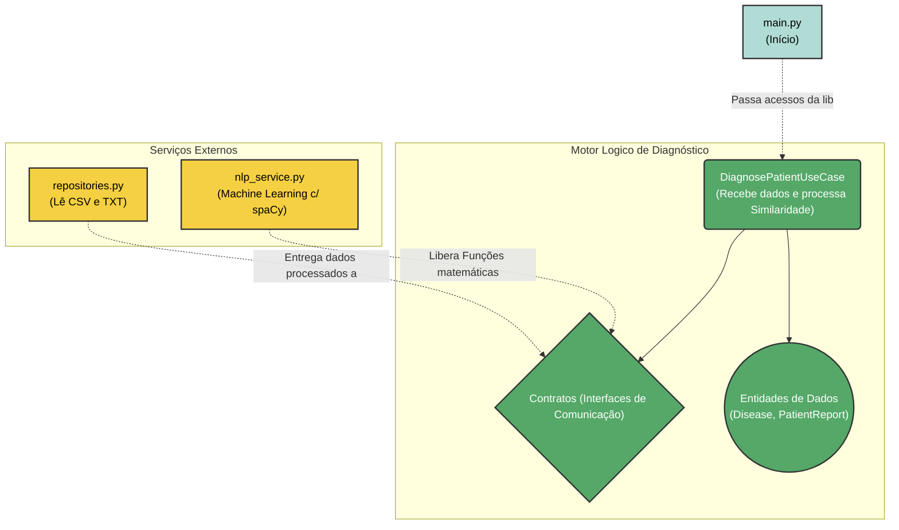

# Módulo de Diagnóstico

## 🏗 Estrutura e Interações

O agrupamento de arquivos é separado em responsabilidades práticas para facilitar o fluxo de dados da aplicação. 

O script de entrada (`main.py`) inicia montando os componentes de infraestrutura (leitura em disco e motor de texto) e os fornece para as rotinas avaliadoras.

O diagrama exibe como esses blocos conversam durante a execução:



---

## 🗄 Os Dados

Nossos arquivos textuais ficam em `api/data/`. Eles funcionam simulando diretrizes médicas teóricas e o testemunho prático do paciente:
* **`ontologia.csv`**: Esta tabela correlaciona os nomes exatos das patologias e um bloco extenso de palavras-chaves/sintomas que caracterizam essas doenças. Ele funciona como a matriz base por trás da inteligência do bot.
* **`relatos.txt`**: Conjunto de frases brutas, escritas na voz do paciente. Este é efetivamente as entradas (Inputs) processadas que o script lê para rodar sua avaliação.

---

## 🧠 NLP: Estratégia do Pipeline

O motor do código tenta avaliar quantitativamente o qual perto o modelo vetorial do paciente está do referencial dos seus dados do banco (o .csv). O passo a passo dele na inferência real opera assim:

1. **Tagging (Filtragem):** A rede spaCy lê a frase descritiva completa do paciente e elimina silenciosamente palavras não determinantes. Apenas Substantivos, Adjetivos, Nomes e Verbos são preservados no pipeline.
2. **Lematização**: O `nlp_service.py` reduz esses termos para o formato mais primitivo do dicionário. (Ex: transforma "doeu muito e minha visão ficou cega" para "doer muito e visão ficar cego"). Isso padroniza todos os textos para os eixos cruzarem perfeitamente no Scikit-learn.
3. **Métrica Multidimensional**: Transformados em índices matemáticos sob um vetor usando a matriz `TfidfVectorizer`, o programa captura as frases do paciente que tenham o valor numérico sobreposto ao modelo da doença teórica (Calculado por *`Cosine Similarity`*).

---

## 🚀 Como Rodar Localmente

Certifique-se de estar dentro do diretório (`api/`) e siga o script:

```bash
# 1. Crie e ative o seu ambiente virtual
# No Windows:
python -m venv .venv
.\.venv\Scripts\activate

# No Linux / Mac:
python3 -m venv .venv
source .venv/bin/activate

# 2. Instale as bibliotecas e faça download do modelo PT-BR da língua
pip install -r requirements.txt
python -m spacy download pt_core_news_sm

# 3. Execute a rotina final
python main.py
```

---

## 🧪 Como Testar

Os testes avaliam a carga total das dependências. Neles, averiguamos rapidamente se os relatórios em `.txt` geram o Diagnóstico final adequado mesmo burlando o peso analítico real das libs, usando simulações (Mocks) para atestar que os fluxos semióticos não quebrarão na lógica de negócios local.

```bash
# Você só precisa executar:
pytest tests/ -v
```
