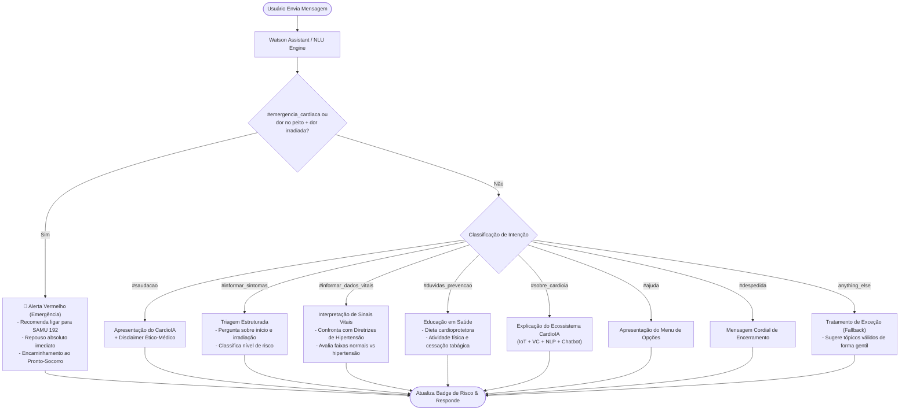
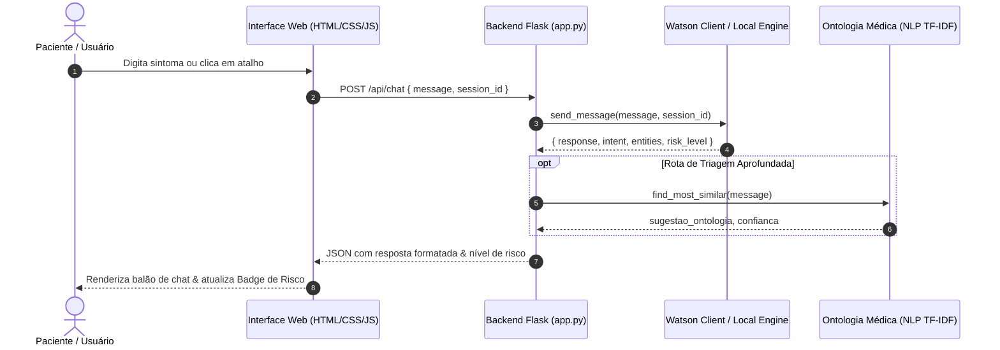

# CardioIA - Relatório Técnico do Fluxo Conversacional (Fase 5)

## 1. Introdução e Contexto

O **CardioIA Assistant** representa a camada conversacional inteligente do ecossistema **CardioIA**. Após as fases de coleta de biomarcadores (IoT), extração de entidades e ontologia médica (NLP) e classificação de patologias em exames de imagem (Visão Computacional), esta Fase 5 consolida a comunicação direta e humanizada com o paciente.

O assistente foi projetado para atuar como uma **ferramenta de apoio à triagem inicial e educação em saúde cardiovascular**, interagindo em linguagem natural, interpretando relatos clínicos e fornecendo orientações estruturadas e seguras.

---

## 2. Modelagem no IBM Watson Assistant

A arquitetura de NLU (*Natural Language Understanding*) foi modelada utilizando as melhores práticas da plataforma **IBM Watson Assistant**, estruturada em três pilares fundamentais:

### 2.1. Catálogo de Intenções (`Intents`)
| Intenção | Descrição | Exemplos de Treinamento |
| :--- | :--- | :--- |
| `#saudacao` | Início de diálogo e cumprimento | *"olá"*, *"bom dia assistente"*, *"iniciar conversa"* |
| `#informar_sintomas` | Relato de queixas e manifestações clínicas | *"estou sentindo dor no peito"*, *"coração disparado"*, *"falta de ar"* |
| `#emergencia_cardiaca` | Sinais de alarme e urgência médica | *"acho que estou infartando"*, *"dor no peito irradiando pro braço esquerdo"*, *"socorro"* |
| `#informar_dados_vitais` | Envio de parâmetros fisiológicos | *"minha pressão deu 14 por 9"*, *"batimentos em 110 bpm"*, *"glicose 130"* |
| `#duvidas_prevencao` | Busca por hábitos saudáveis e orientações | *"como prevenir infarto?"*, *"dicas para controlar a hipertensão"* |
| `#sobre_cardioia` | Explicação sobre a plataforma | *"o que é o cardioia?"*, *"quem é você?"* |
| `#ajuda` | Menu e comandos disponíveis | *"ajuda"*, *"quais opções você tem?"* |
| `#despedida` | Finalização do atendimento | *"tchau"*, *"muito obrigado, até logo"* |

### 2.2. Entidades Clínicas (`Entities`)
- **`@sintoma`**: Identifica manifestações patológicas específicas:
  - `dor_no_peito` (sinônimos: dor precordial, aperto torácico, queimação no peito);
  - `falta_de_ar` (sinônimos: dispneia, cansaço respiratório, sufocamento);
  - `palpitacao` (sinônimos: taquicardia, batedeira, arritmia);
  - `tontura` (sinônimos: vertigem, sensação de desmaio, síncope);
  - `inchaco` (sinônimos: edema em membros inferiores, tornozelos inchados);
  - `dor_irradiada` (sinônimos: dor no braço esquerdo, dor na mandíbula, dor interescapular).
- **`@sinal_vital`**: Extrai menções a `pressao_arterial`, `frequencia_cardiaca` e `glicemia`.
- **`@fator_risco`**: Reconhece comorbidades como `hipertensao`, `diabetes`, `tabagismo`, `colesterol_alto` e `sedentarismo`.

---

## 3. Diagrama do Fluxo de Conversação (Árvore de Diálogo)

---

## 4. Segurança do Paciente, Ética e Tratamento de Exceções

1. **Aviso Legal e Limitação de Responsabilidade:** Todo início de conversa e a interface visual contam com disclaimer explícito indicando que o assistente é um protótipo acadêmico para apoio e triagem, jamais substituindo a consulta médica presencial.
2. **Escalonamento de Emergência (Gatilho de Alto Risco):** Relatos com sinais clínicos de síndrome coronariana aguda (dor retroesternal com irradiação, dispneia aguda ou síncope) acionam imediatamente a resposta de urgência com orientação de contato imediato com o **SAMU (192)** ou busca rápida por pronto-socorro.
3. **Resiliência e Fallback:** Mensagens com vocabulário fora do escopo ou ambíguas são capturadas pelo nó `anything_else`, instruindo o paciente a reformular a queixa ou escolher opções guiadas pelos botões de atalho (*quick chips*).

---

## 5. Arquitetura de Integração Técnica

O sistema foi estruturado seguindo os princípios de separação de responsabilidades e código limpo:

- **Backend:** Python + **Flask**, integrando o SDK oficial `ibm-watson` com fallback automático para motor local baseado no JSON de exportação.
- **Frontend:** Single Page Interface responsiva com balões de conversa, indicador de digitação, badge dinâmico de severidade e atalhos rápidos.
- **Exportação do Assistente:** Arquivo padronizado `api/chatbot/cardioia_watson_assistant.json`, pronto para importação direta no IBM Watson Cloud.

---

## 6. Conclusão

A implementação da Fase 5 entrega um assistente conversacional robusto, humanizado e tecnicamente alinhado com as diretrizes do projeto CardioIA, unindo inteligência de processamento de linguagem natural à segurança clínica indispensável no domínio da saúde digital.
