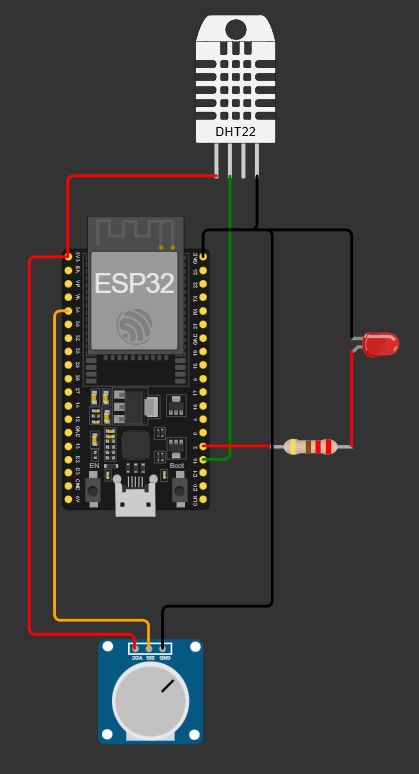
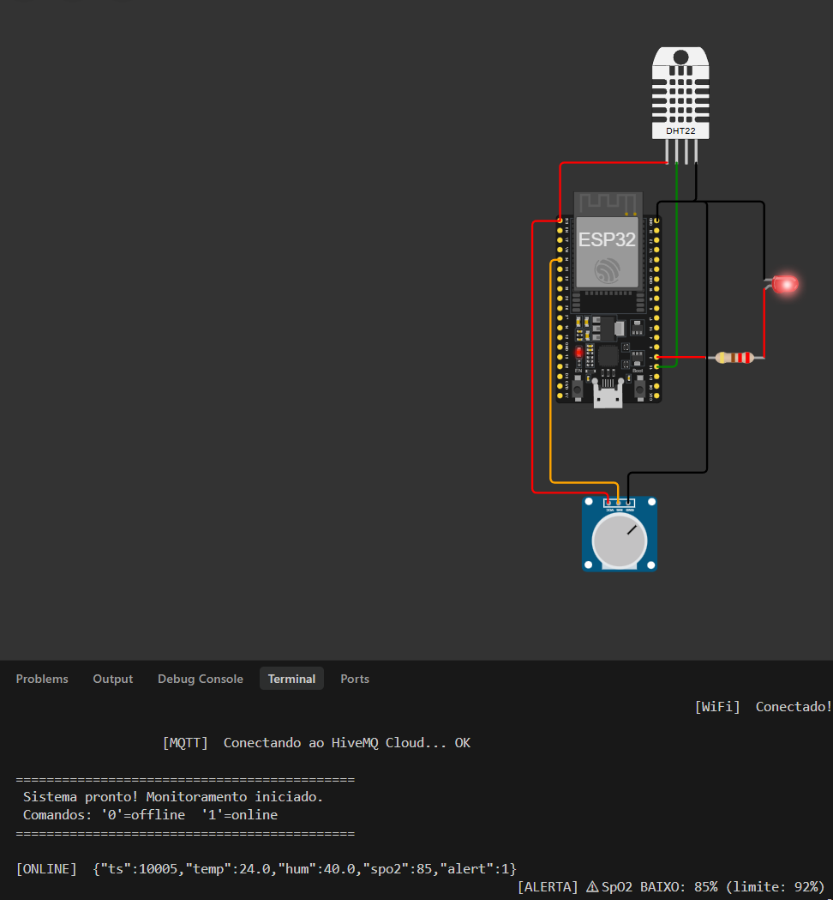
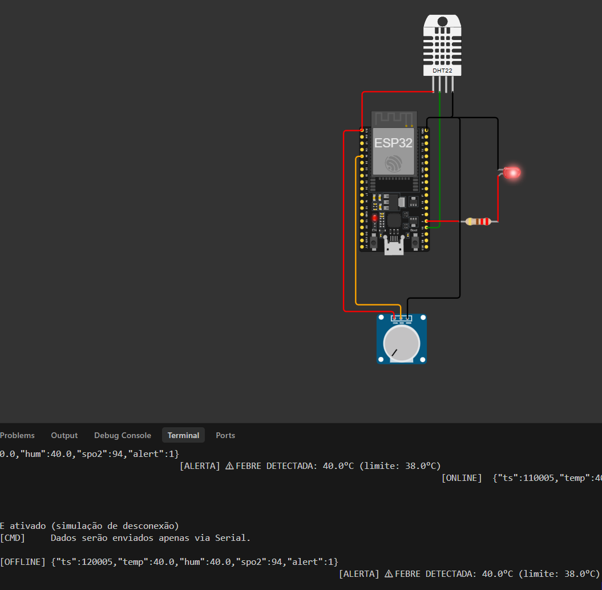

# CardioIA — Relatório Parte 1: Armazenamento e Processamento Local (Edge Computing)

---

## 1. Introdução

Este relatório descreve a **Parte 1** do módulo IoT do projeto CardioIA: o desenvolvimento de um protótipo funcional de sistema vestível de monitoramento cardíaco utilizando o microcontrolador **ESP32** simulado na plataforma **Wokwi**.

O objetivo central é simular um cenário realista de monitoramento domiciliar de pacientes cardiológicos, onde o dispositivo deve ser capaz de operar de forma autônoma mesmo durante períodos de indisponibilidade de rede, garantindo que nenhuma informação clínica relevante seja perdida.

---

## 2. Sensores Utilizados

O projeto utiliza 2 sensores:

### 2.1 Sensor de Temperatura e Umidade — DHT22

| Parâmetro | Valor |
| :--- | :--- |
| **Componente** | DHT22 |
| **GPIO** | 15 |
| **Dados capturados** | Temperatura (°C) e Umidade relativa (%) |
| **Intervalo de leitura** | 10 segundos |

**Justificativa clínica:** A temperatura corporal é um dos sinais vitais mais fundamentais na cardiologia. Febre acima de 38°C pode indicar processos infecciosos como endocardite bacteriana, inflamação miocárdica (miocardite), ou resposta pós-cirúrgica. A umidade ambiente complementa o monitoramento, pois ambientes com umidade extrema podem agravar condições respiratórias em pacientes cardiopatas.

### 2.2 Sensor de Oximetria — SpO2

| Parâmetro | Valor |
| :--- | :--- |
| **Componente** | Potenciômetro (simulando sensor óptico tipo MAX30102) |
| **GPIO** | 34 (ADC1) |
| **Dados capturados** | Saturação de oxigênio no sangue (SpO2), faixa 85-100% |
| **Mapeamento** | ADC 0-4095 → SpO2 85-100% |

**Justificativa clínica:** A oximetria de pulso (SpO2) é essencial no acompanhamento de pacientes cardiológicos. Valores de SpO2 abaixo de 92% podem indicar insuficiência cardíaca descompensada, embolia pulmonar, edema pulmonar agudo ou comprometimento respiratório grave. Em um dispositivo vestível real, o sensor MAX30102 seria utilizado para esta medição; no ambiente Wokwi, o potenciômetro permite simular diferentes cenários clínicos girando o dial.

### 2.3 Indicador de Alerta — LED Vermelho

| Parâmetro | Valor |
| :--- | :--- |
| **Componente** | LED vermelho + resistor 220Ω |
| **GPIO** | 2 |
| **Condição de ativação** | Temperatura > 38.0°C **OU** SpO2 < 92% |

O LED funciona como um alerta visual imediato para o paciente ou cuidador, indicando que um dos parâmetros vitais ultrapassou os limites clínicos seguros.

---

## 3. Diagrama do Circuito

O circuito foi montado no simulador Wokwi com a seguinte configuração:
> 

---

## 4. Fluxo de Funcionamento

O firmware opera em um ciclo contínuo, executando as seguintes etapas a cada intervalo de 10 segundos:

```
              ┌──────────────┐
              │    SETUP     │
              │  DHT22 init  │
              │  GPIO config │
              │  WiFi connect│
              │  MQTT connect│
              └──────┬───────┘
                     │
              ┌──────▼──────┐
         ┌────│    LOOP     │────┐
         │    └──────┬──────┘    │
         │           │           │
    ┌────▼─────┐     │    ┌─────▼────┐
    │ Comandos │     │    │  MQTT    │
    │ Serial   │     │    │  loop()  │
    │ '0'/'1'  │     │    └──────────┘
    └──────────┘     │
                     │
           ┌─────────▼─────────┐
           │   Ler Sensores    │
           │  DHT22 → Temp/Hum │
           │  Pot   → SpO2     │
           └─────────┬─────────┘
                     │
           ┌─────────▼─────────┐
           │ Verificar Alertas │
           │ Temp > 38°C?      │
           │ SpO2 < 92%?       │
           │ → LED ON/OFF      │
           └─────────┬─────────┘
                     │
              ┌──────▼──────┐
              │   Online?   │
              └──┬──────┬───┘
            SIM  │      │  NÃO
         ┌───────▼┐  ┌──▼────────┐
         │Publicar│  │  Enviar   │
         │ via    │  │  via      │
         │ MQTT   │  │  Serial   │
         └────────┘  └───────────┘
```

### Detalhamento das etapas:

1. **Inicialização (setup):** O sistema inicializa o sensor DHT22, configura os pinos GPIO (LED e potenciômetro), conecta-se à rede Wi-Fi virtual do Wokwi (`Wokwi-GUEST`) e estabelece conexão segura com o broker MQTT via TLS.

2. **Leitura dos sensores:** A cada 10 segundos, o firmware lê a temperatura e umidade do DHT22 e o valor analógico do potenciômetro (mapeado para SpO2 85-100%).

3. **Verificação de alertas:** Os valores lidos são comparados contra os limites clínicos configurados. Se qualquer valor ultrapassar o limite, o LED de alerta é acionado.

4. **Serialização JSON:** Os dados são formatados em um objeto JSON estruturado:
   ```json
   {"ts":10006,"temp":"24.0","hum":"40.0","spo2":97,"alert":0}
   ```

5. **Decisão de envio:** Se o sistema está **online**, os dados são publicados via MQTT para o broker HiveMQ Cloud. Se está **offline**, os dados são enviados para o Monitor Serial como registro local.

---

## 5. Lógica de Resiliência Offline
O sistema continua operando e registrando dados mesmo sem conectividade de rede.

### 5.1 Estratégia Implementada

A estratégia funciona da seguinte forma:

| Estado | Comportamento | Saída |
| :--- | :--- | :--- |
| **ONLINE** | Dados publicados via MQTT no broker HiveMQ Cloud | Tópicos MQTT + Serial `[ONLINE]` |
| **OFFLINE** | Dados registrados exclusivamente no Monitor Serial | Serial `[OFFLINE]` + JSON completo |

### 5.2 Simulação de Conectividade

A conectividade Wi-Fi é simulada através de uma **variável booleana** (`simulatedOffline`) controlada via comandos no Monitor Serial:

- **Digitar `0`** → Ativa o modo **OFFLINE** (simula queda de conexão Wi-Fi)
- **Digitar `1`** → Ativa o modo **ONLINE** (simula retorno da conexão)

Esta abordagem permite demonstrar o comportamento do sistema em ambos os cenários durante a simulação no Wokwi, sem necessidade de hardware físico.

### 5.3 Reflexão: Resiliência em Hardware Real

Em um cenário com ESP32 físico, a estratégia completa de resiliência incluiria:

1. **Armazenamento em SPIFFS/LittleFS:** Cada leitura offline seria armazenada como uma linha JSON no sistema de arquivos flash, com limite de **500 amostras** (~50KB), cobrindo aproximadamente **8 horas** de monitoramento.
2. **Padrão Store-and-Forward:** Ao reconectar, o dispositivo sincronizaria automaticamente todas as amostras pendentes via MQTT antes de retomar a publicação em tempo real.
3. **Descarte FIFO:** Ao atingir o limite de armazenamento, as amostras mais antigas seriam descartadas, priorizando dados recentes que são clinicamente mais relevantes.
4. **Alternativa com Cartão microSD:** Para cenários com longos períodos offline, um shield de cartão microSD expandiria significativamente a capacidade de armazenamento.

### Print do sistema em modo ONLINE:

> 

### Print do sistema em modo OFFLINE:

> 

---

## 6. Papel do Edge Computing na Saúde

### Processamento Local
O ESP32 realiza **toda a lógica de decisão localmente** — leitura de sensores, verificação de limites clínicos e acionamento de alertas — sem depender de comunicação com a nuvem. Isso reduz a latência de resposta em situações críticas e garante autonomia operacional.

### Eficiência Energética
O intervalo de leitura permite equilibrar a granularidade dos dados com o consumo energético.

### Privacidade e Segurança
Ao processar e filtrar dados localmente, o sistema reduz o volume de dados sensíveis transmitidos pela rede, alinhando-se às práticas de **privacidade by design** exigidas pela LGPD para dados de saúde.