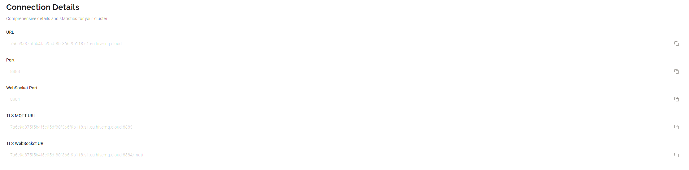
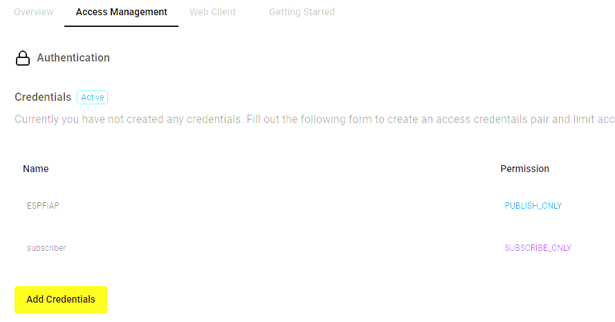
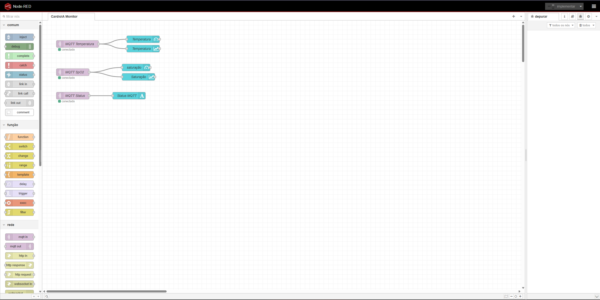
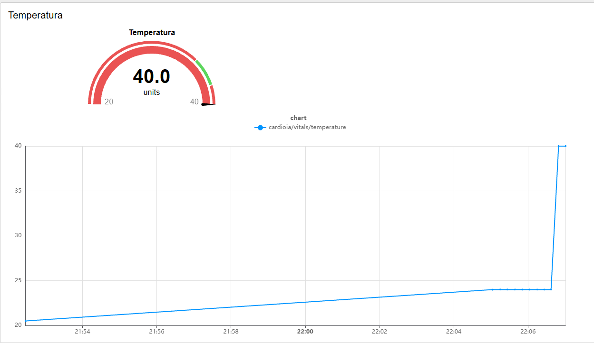
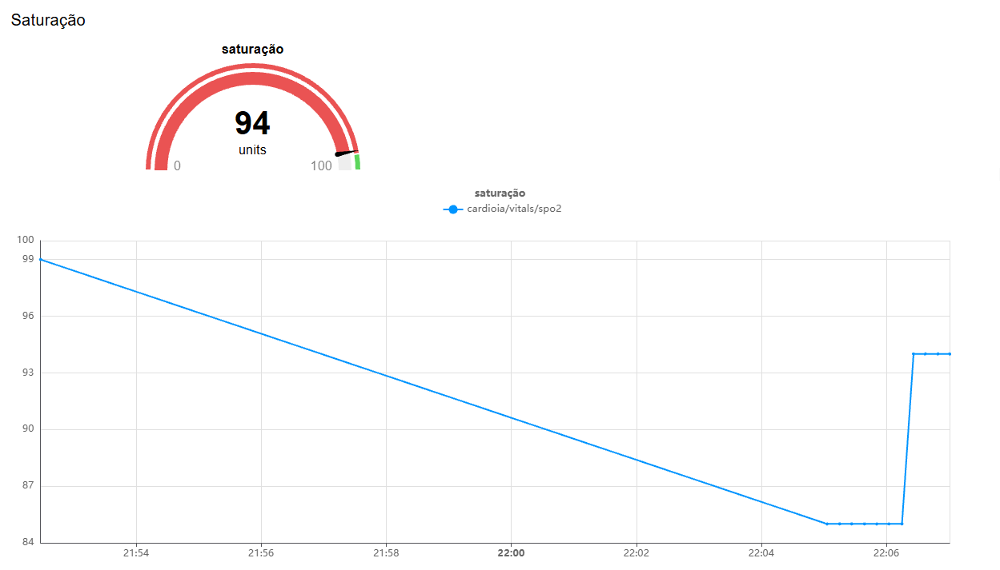
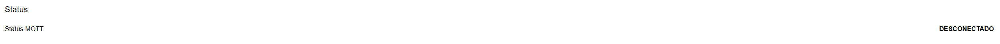
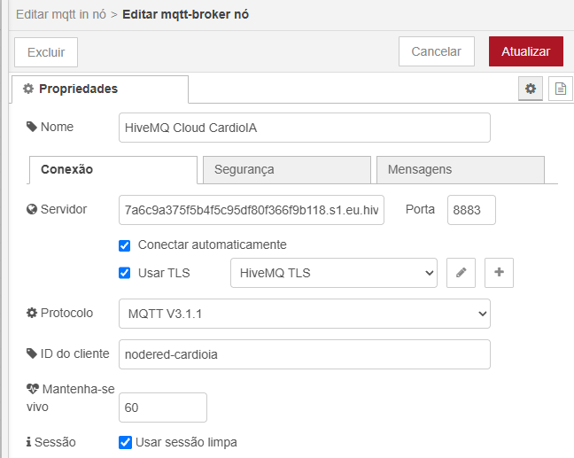

# CardioIA — Relatório Parte 2: Transmissão para Nuvem e Visualização

---

## 1. Introdução

Este relatório descreve a **Parte 2** do módulo IoT do projeto CardioIA: a construção de um sistema completo de transmissão de dados para a nuvem via protocolo **MQTT** e a visualização em tempo real através de dashboards no **Node-RED**.

```
Captura (ESP32) → Transmissão (MQTT/TLS) → Broker (HiveMQ Cloud) → Dashboard (Node-RED)
```

O objetivo é demonstrar como dados de sinais vitais capturados por um dispositivo IoT podem ser transmitidos de forma segura para a nuvem e apresentados em dashboards interativos com alertas automáticos, simulando um cenário real de telemedicina.

---

## 2. Protocolo MQTT

### 2.1 O que é MQTT?

- **Modelo Publish/Subscribe:** Desacopla produtores (publishers) de consumidores (subscribers) através de um intermediário (broker), permitindo comunicação assíncrona e escalável.
- **Baixo overhead:** Cabeçalho mínimo de apenas 2 bytes, ideal para redes com largura de banda limitada.
- **Quality of Service (QoS):** Três níveis de garantia de entrega (0, 1 e 2) para diferentes cenários de criticidade.
- **Last Will and Testament (LWT):** Mecanismo que permite detecção automática de desconexões inesperadas.

### 2.2 Por que MQTT na Saúde Digital?

No contexto de monitoramento cardíaco, o MQTT é especialmente adequado porque:

1. **Eficiência energética:** O baixo consumo de banda prolonga a vida útil da bateria em dispositivos vestíveis.
2. **Comunicação em tempo real:** A arquitetura pub/sub garante que dados críticos cheguem ao dashboard instantaneamente.
3. **Confiabilidade:** O QoS 1 (usado neste projeto) garante que cada mensagem seja entregue ao menos uma vez.
4. **Detecção de falhas:** O LWT notifica automaticamente o dashboard quando o dispositivo perde conexão.

---

## 3. Arquitetura de Comunicação

### 3.1 Diagrama do Fluxo Completo

```
┌──────────────┐     MQTT/TLS       ┌────────────────┐      MQTT       ┌──────────────┐
│              │    (porta 8883)    │                │   (porta 8883)  │              │
│    ESP32     │ ─────────────────► │  HiveMQ Cloud  │ ──────────────► │   Node-RED   │
│  (Publisher) │                    │    (Broker)    │                 │ (Subscriber) │
│              │                    │                │                 │              │
│  Usr: ESPFIAP│                    │  Gerencia      │                 │ Usr: subscr. │
│              │                    │  tópicos,      │                 │              │
│  Publica em: │                    │  autentica,    │                 │ Subscreve:   │
│  cardioia/   │                    │  roteia msgs   │                 │ cardioia/#   │
│  vitals/     │                    │                │                 │              │
└──────────────┘                    └────────────────┘                 └──────┬───────┘
                                                                              │
                                                                     ┌────────▼─────────┐
                                                                     │    Dashboard     │
                                                                     │    Node-RED UI   │
                                                                     │ :1880/dashboard  │
                                                                     │   • Gauge Temp   │
                                                                     │   • Gauge SpO2   │
                                                                     │   • Gráficos     │
                                                                     └──────────────────┘
```

### 3.2 Configuração do Broker MQTT — HiveMQ Cloud

O broker utilizado é o **HiveMQ Cloud**, uma plataforma gerenciada que oferece comunicação MQTT segura com TLS/SSL.

| Parâmetro | Valor |
| :--- | :--- |
| **Broker URL** | `7a6c9a375f5b4f5c95df80f366f9b118.s1.eu.hivemq.cloud` |
| **Porta** | `8883` (TLS/SSL — comunicação criptografada) |
| **Protocolo** | MQTT v3.1.1 |
| **Autenticação** | Usuário e senha (obrigatória) |

#### Credenciais de Acesso

O HiveMQ Cloud foi configurado com **credenciais separadas** para cada papel, seguindo o princípio de menor privilégio:

| Papel | Usuário | Senha | Permissão |
| :--- | :--- | :--- | :--- |
| **Publisher** (ESP32) | `ESPFIAP` | `ESPFiap123` | Publicar em `cardioia/#` |
| **Subscriber** (Node-RED) | `subscriber` | `Subscriber123` | Subscrever `cardioia/#` |

### Print da configuração do broker HiveMQ Cloud:

> 
> 

### 3.3 Tópicos MQTT

Os dados são organizados em tópicos MQTT hierárquicos, seguindo a convenção `projeto/categoria/parâmetro`:

| Tópico | Descrição | Tipo de Dado | Exemplo |
| :--- | :--- | :--- | :--- |
| `cardioia/vitals/temperature` | Temperatura corporal em °C | Float | `"36.5"` |
| `cardioia/vitals/spo2` | Saturação de oxigênio em % | Integer | `"97"` |
| `cardioia/status` | Status do dispositivo | String | `"CONECTADO"` |

### 3.4 Last Will and Testament (LWT)

O ESP32 configura uma mensagem **LWT** no momento da conexão MQTT. Se o dispositivo desconectar inesperadamente (queda de energia, falha de rede), o broker HiveMQ publica automaticamente a mensagem `"DESCONECTADO"` no tópico `cardioia/status`.

Isso permite que o dashboard Node-RED detecte imediatamente quando o dispositivo de monitoramento do paciente saiu do ar — informação crítica em um contexto de saúde.

### 3.5 Segurança da Comunicação

A comunicação entre o ESP32 e o HiveMQ Cloud utiliza **TLS/SSL na porta 8883**, garantindo:

- **Criptografia em trânsito:** Todos os dados de sinais vitais são criptografados durante a transmissão, impossibilitando interceptação por terceiros.
- **Autenticação mútua:** Tanto o publisher quanto o subscriber precisam se autenticar com credenciais válidas.
- **Conformidade com LGPD:** A criptografia de dados de saúde em trânsito é um requisito da Lei Geral de Proteção de Dados para dados sensíveis.

---

## 4. Código do ESP32 — Comunicação MQTT

O firmware do ESP32 implementa a comunicação MQTT utilizando as seguintes bibliotecas:

- **WiFiClientSecure:** Estabelece conexão TCP com TLS para o broker.
- **PubSubClient:** Implementa o protocolo MQTT sobre a conexão segura.
- **ArduinoJson:** Serializa os dados dos sensores em formato JSON.

### Trecho principal da publicação MQTT:

```cpp
void publishLiveData(float temp, float hum, int spo2, bool alert) {
    // Publicar temperatura no tópico dedicado
    String tempStr = String(temp, 1);
    mqtt.publish(TOPIC_TEMP, tempStr.c_str(), true);

    // Publicar SpO2 no tópico dedicado
    String spo2Str = String(spo2);
    mqtt.publish(TOPIC_SPO2, spo2Str.c_str(), true);

    // Publicar status de alerta
    mqtt.publish(TOPIC_STATUS, alert ? "ALERTA" : "NORMAL", true);
}
```

O parâmetro `true` no final de cada `publish()` define a flag **retain**, fazendo com que o broker armazene a última mensagem de cada tópico. Assim, quando o Node-RED se conecta (ou reconecta), ele recebe imediatamente o último valor conhecido.

## 5. Dashboard Node-RED

### 5.1 Configuração do Ambiente

O Node-RED foi instalado localmente via **npm** (Node Package Manager):

```bash
# Instalar o Node-RED globalmente
npm install -g node-red

# Iniciar o Node-RED
node-red
```

**Acesso:**
- **Editor de Flows:** `http://localhost:1880`
- **Dashboard:** `http://localhost:1880/dashboard`

**Pacote adicional necessário:** `node-red-dashboard` (instalado via Menu ☰ → Manage Palette → Install → pesquisar `node-red-dashboard`).

### 5.2 Importação do Flow

O flow completo está exportado no arquivo `nodered/flows.json` e pode ser importado diretamente:

1. Abrir o editor Node-RED em `http://localhost:1880`.
2. Ir em Menu (☰) → **Import**.
3. Colar o conteúdo do arquivo `nodered/flows.json`.
4. Clicar em **Import** e depois em **Deploy**.
5. Configurar o nó do broker MQTT com as credenciais do subscriber.

### Print do editor Node-RED com o flow importado:

> 

### 5.3 Componentes do Dashboard

O dashboard foi projetado com os seguintes componentes visuais, organizados em três grupos:
- **Temperatura**
- **Saturação**
- **Status**


**1. Gauge de Temperatura (🌡️)**
- **Tipo:** Medidor analógico (gauge)
- **Faixa:** 20°C — 40°C
- **Zonas de cor:**
  - 🔴 Vermelho (abaixo de 35°C): Hipotermia / Abaixo do normal
  - 🟢 Verde (35°C - 38°C): Faixa normal
  - 🔴 Vermelho (acima de 38°C): Febre / Alerta
- **Tópico MQTT:** `cardioia/vitals/temperature`

**2. Gráfico de Temperatura**
- **Tipo:** Gráfico de linha temporal
- **Janela:** Últimos 5 minutos
- **Atualização:** Tempo real, a cada nova mensagem MQTT recebida

**3. Gauge de SpO2 (💓)**
- **Tipo:** Medidor analógico (gauge)
- **Faixa:** 0% — 100%
- **Zonas de cor:**
  - 🔴 Vermelho (0-95%): Hipoxemia grave
  - 🟢 Verde (95-100%): Faixa normal
- **Tópico MQTT:** `cardioia/vitals/spo2`

**4. Gráfico de SpO2**
- **Tipo:** Gráfico de linha temporal
- **Janela:** Últimos 5 minutos

### Print Temperatura:

> 

### Print Saturação:

> 

### Print Status:

> 

### 5.4 Lógica do Flow Node-RED

O flow implementa a seguinte lógica de processamento:

```
┌──────────────┐     ┌────────────┐     ┌──────────────────┐
│  MQTT In     │     │            │     │  Gauge Temp      │
│  temperatura ├────►│            ├────►│  Chart Temp      │
│              │     │            │     └──────────────────┘
└──────────────┘     │            │     
                     │  Parsing   │
┌──────────────┐     │  & Routing │    
│  MQTT In     │     │            │     
│  spo2        ├────►│            │     
│              │     │            │     ┌──────────────────┐
└──────────────┘     │            ├────►│  Gauge SpO2      │
                     │            │     │  Chart SpO2      │
┌──────────────┐     │            │     └──────────────────┘
│  MQTT In     │     │            │     
│  status      ├────►│            │
│              │     │            │     
└──────────────┘     └────────────┘     
                                        
```

## 6. Configuração do Broker MQTT no Node-RED

Para configurar a conexão com o HiveMQ Cloud no Node-RED:

1. **Clicar duas vezes** em qualquer nó MQTT no flow.
2. Clicar no **ícone de lápis** ao lado de "Server" para editar o broker.
3. Preencher os campos:
   - **Server:** `7a6c9a375f5b4f5c95df80f366f9b118.s1.eu.hivemq.cloud`
   - **Port:** `8883`
   - **Enable secure (SSL/TLS):** ✅ Ativado
4. Na aba **Security:**
   - **Username:** `subscriber`
   - **Password:** `Subscriber123`
5. Clicar em **Update** e depois em **Deploy**.

### Print da configuração do broker no Node-RED:

> 

---

## 7. Fluxo Completo de Comunicação

Resumo do fluxo end-to-end de uma leitura de sensor até a exibição no dashboard:

| Etapa | Componente | Ação |
| :---: | :--- | :--- |
| 1 | **DHT22 / Potenciômetro** | Sensor realiza leitura (temp, umidade, SpO2) |
| 2 | **ESP32 (firmware)** | Processa dados, verifica alertas, monta JSON |
| 3 | **WiFiClientSecure** | Estabelece conexão TLS com o broker |
| 4 | **PubSubClient** | Publica dados nos tópicos MQTT |
| 5 | **HiveMQ Cloud** | Recebe, autentica e roteia mensagens |
| 6 | **Node-RED (MQTT In)** | Subscreve tópicos e recebe dados |
| 7 | **Node-RED (Dashboard)** | Exibe gauges, gráficos e alertas |

**Latência total estimada:** < 500ms do sensor ao dashboard.

---

## 8. Considerações sobre Fog e Cloud Computing

### Fog Computing
O **broker MQTT** atua como camada de **Fog Computing**, intermediando a comunicação entre o dispositivo edge (ESP32) e as aplicações na nuvem. O broker gerencia autenticação, roteamento de mensagens e armazenamento temporário (retain), reduzindo a carga sobre os endpoints.

### Cloud Computing
O **Node-RED** e o **dashboard** representam a camada de **Cloud Computing**, onde os dados são processados, visualizados e analisados. Em um cenário de produção, esta camada poderia ser estendida com:
- Armazenamento em banco de dados (InfluxDB, TimescaleDB)
- Integração com sistemas de prontuário eletrônico (EHR)
- Algoritmos de ML para detecção de anomalias
- Notificações push para equipe médica

### Segurança End-to-End
- **Camada de transporte:** TLS/SSL (porta 8883) criptografa todos os dados em trânsito.
- **Camada de aplicação:** Autenticação por credenciais em ambos os endpoints.
- **Camada de rede:** LWT detecta falhas de comunicação automaticamente.